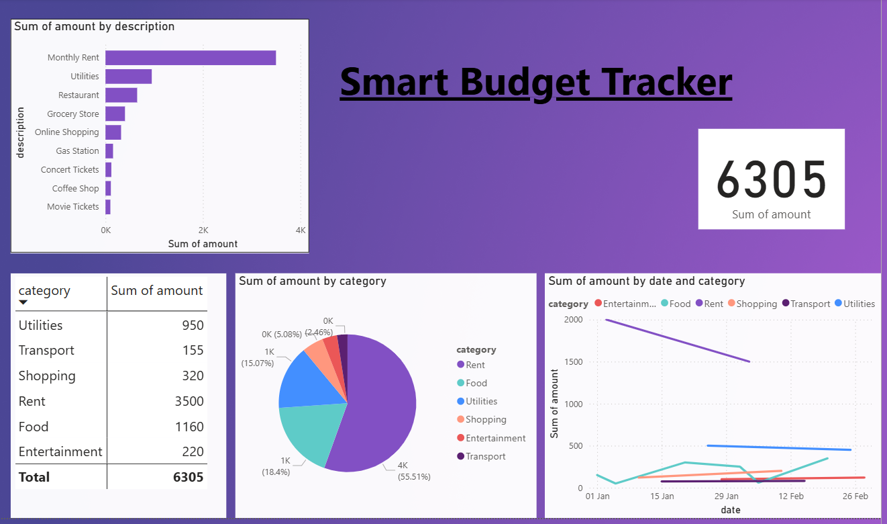

# Smart Budget Tracker



## Overview

Smart Budget Tracker is a data analytics project designed to help users manage and analyze their monthly financial transactions. It leverages Python for data cleaning, machine learning for transaction classification and prediction, Excel for data input/output, and Power BI for interactive dashboarding. An optional Streamlit interface allows users to upload their own transaction files and view results instantly.

---

## Features

- **Upload/Download Transactions:** Supports CSV/Excel formats from banks.
- **Automated Data Cleaning:** Removes duplicates, handles missing values, and standardizes data.
- **Auto-Classification:** Categorizes transactions (e.g., Food, Rent, Shopping) using ML and rule-based logic.
- **Spending Prediction:** Forecasts future expenses based on historical patterns.
- **Interactive Dashboards:** Visualizes spending breakdowns, trends, and forecasts in Power BI.
- **Summary Reports:** Exports cleaned and analyzed data to Excel.
- **User Interface:** Streamlit app for easy file upload and instant insights.

---

## Project Structure

```
smart-budget-tracker/
│
├── data/
│   ├── sample_transactions.csv
│   ├── cleaned_transactions.csv
│   └── processed_transactions.xlsx
│
├── src/
│   ├── data_cleaning.py
│   ├── classification.py
│   ├── prediction.py
│   ├── export_to_excel.py
│   └── streamlit_app.py
│
├── powerbi/
│   ├── dashboard.pbix
│   └── dashboard_screenshot.png
│
├── requirements.txt
└── README.md
```

---

## Dashboard Highlights

- **Spending by Description:** Bar chart of top merchants and expense types.
- **Spending by Category:** Pie chart showing percentage breakdown.
- **Total Spending:** Card visual for overall expenses.
- **Monthly Summary:** Table of category-wise totals.
- **Trends:** Line chart of spending over time by category.


---

## How to Run

### 1. Clone the Repository

```bash
git clone https://github.com/yourusername/smart-budget-tracker.git
cd smart-budget-tracker
```

### 2. Install Dependencies

```bash
pip install -r requirements.txt
```

### 3. Run Data Cleaning & Analysis

Edit and run the Python scripts in the `src` folder as needed.

### 4. Launch Streamlit Interface (Optional)

```bash
streamlit run src/streamlit_app.py
```

### 5. Explore Power BI Dashboard

Open `powerbi/dashboard.pbix` in Power BI Desktop to view and interact with the dashboard.

---

## Sample Results


---

## Technologies Used

- **Python:** Data cleaning, classification, prediction
- **Pandas, scikit-learn:** Data processing and ML
- **Excel:** Data input/output
- **Power BI:** Dashboarding and visualization
- **Streamlit:** User interface for uploads and insights

---

## Author

- **Your Name**
- Data Analytics Bootcamp Portfolio Project

---

## License

This project is licensed under the MIT License.

---

## Contact

For questions or collaboration, please reach out via [your-email@example.com](mailto:your-email@example.com).